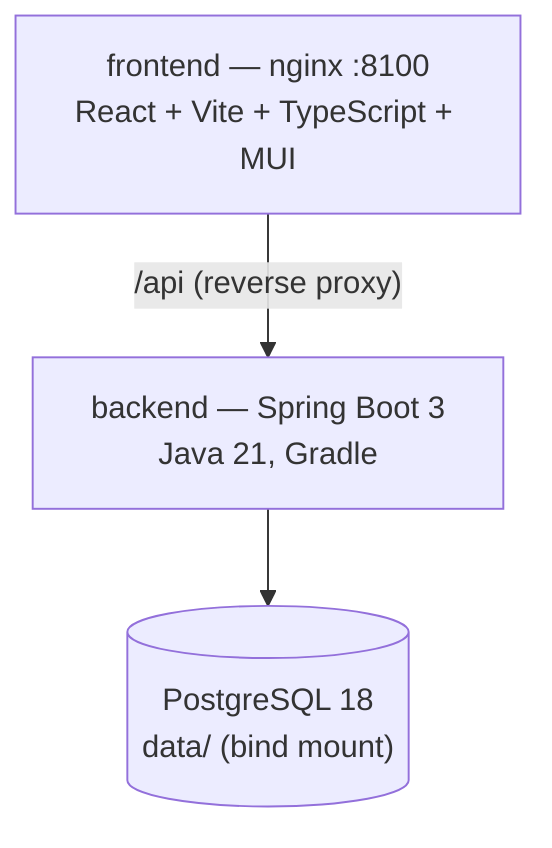

# Finance Dashboard

A personal expense dashboard: import bank statements, parse them into a normalized
transaction model, categorize spending into groups, and view statistics that show where
money goes.

## How to import a statement

1. On the Import page upload one or more bank statement PDFs. The owning account is read from
   each file — reused when it already exists, created automatically otherwise.
2. Transactions are stored, each valued in every supported currency at its own date, and the
   statement is filed. Re-uploading the same file is a no-op.
3. Switch the display currency on the dashboard to read the same transactions in another
   currency.

## Architecture



- The **frontend** serves the built app and proxies `/api` to the backend.
- The **backend** imports bank statements (per-bank parsers) and values every transaction in
  each supported currency at its own date using official NBP rates, then answers statistics.
- **PostgreSQL** persists everything; its data directory is a bind mount on the deploy host.

## Tech stack

| Concern   | Choice                              |
|-----------|-------------------------------------|
| Backend   | Java 21, Spring Boot 3, Gradle      |
| Persistence | Spring Data JPA, Flyway migrations |
| Frontend  | Vite + React + TypeScript, MUI      |
| Database  | PostgreSQL 18                       |
| FX rates  | NBP (api.nbp.pl), DB-first          |

## Deploy

Requires Docker with the Compose plugin. Everything stateful lives **outside** the repository:
the Compose file, the `.env` secrets, and the `data/` directory.

```bash
git clone <repo-url> app
cp app/deploy/docker-compose.yml ./docker-compose.yml
cp app/.env.example .env     # then fill in DB_USER / DB_PASSWORD
mkdir data                   # must be empty on the first run
docker compose up -d --build
```

`data/` must be empty on the first run: the Postgres entrypoint refuses to initialise over an
existing cluster, and that guard is what stops it silently adopting a foreign data directory.
The first build pulls the JDK, Node and nginx images and compiles both applications, so expect
5–10 minutes; later rebuilds reuse the Gradle and npm caches.

The UI is published on `:8100` (`FRONTEND_PORT`). Neither the database nor the API publishes a
port — both are reachable only from the Compose network, so the UI is the single entry point.

> **Postgres 18 keeps its cluster at `./data/18/docker`**, so the service mounts the *parent*
> directory, `./data:/var/lib/postgresql`. Mounting `/var/lib/postgresql/data` — correct for
> Postgres 17 and earlier — writes nothing to the host and leaves the cluster in an anonymous
> volume that `docker compose down` destroys, taking every transaction with it. Back up `./data`
> whole, not `./data/*`.

`.env` supplies `DB_USER` and `DB_PASSWORD` (both required — Compose fails with a named error
rather than starting with empty credentials), plus optional `FINANCE_BASE_CURRENCY`, `TZ` and
`FRONTEND_PORT`. See `.env.example`.

To update a running deployment:

```bash
cd app && git pull
cd .. && docker compose up -d --build
```

Compose rebuilds only the images whose sources changed. The database and its volume are
untouched, and Flyway applies any new migrations on backend start.

## Local development

Requires JDK 21, Node 20+, and a PostgreSQL 18 database. **The backend reads its credentials
from the environment — nothing is committed**, so `bootRun` and `./gradlew test` fail until
they are exported:

```bash
export SPRING_DATASOURCE_USERNAME=...
export SPRING_DATASOURCE_PASSWORD=...
cd backend && ./gradlew bootRun    # API on http://localhost:8080, migrations run on startup
cd frontend && npm run dev         # dev server on http://localhost:5173, proxies /api
```

`SPRING_DATASOURCE_URL` defaults to `jdbc:postgresql://localhost:5432/finance`; the integration
tests use `finance_test` on the same host, with the same credentials. Both default credentials
used to be committed and are no longer — if a build fails with
`password authentication failed for user "${SPRING_DATASOURCE_USERNAME}"`, that variable is
simply unset.

## API docs

When the backend runs, OpenAPI / Swagger UI is available at
http://localhost:8080/swagger-ui.html.

## Project layout

```
backend/    Gradle application (single module)
frontend/   Vite + React + TypeScript
docs/       evergreen reference (architecture, data model, parsers, FX rates)
deploy/     committed Compose template (placed outside the repo on the host)
local/      development-only workspace (not committed)
```

## License

Proprietary.
